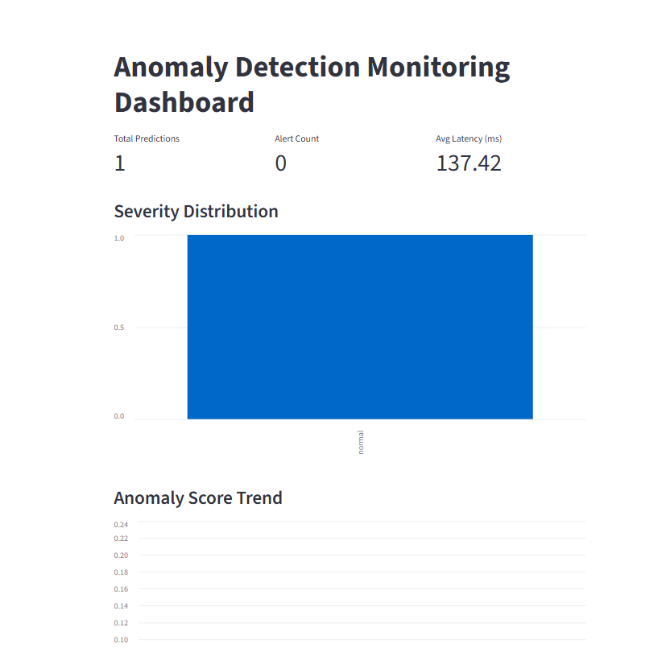

# Kaggle Turbofan Jet Engine Anomaly Detection


NASA turbofan engine degradationシミュレーション向けの
LSTM AutoEncoderによる異常検知システムです。

This project focuses not only on model training,
but also on operational AI system design including:

- FastAPI inference API
- prediction logging
- monitoring dashboard
- drift monitoring
- retraining decision support
- Docker Compose deployment

## Overview

- 入力: エンジンごとの時系列センサーデータ
- モデル: LSTM AutoEncoder
- 推論: 再構成誤差を anomaly score として算出
- API: FastAPI `/predict`
- ログ: `logs/predictions.jsonl`, `logs/predictions.db`
- 実行環境: Docker / Docker Compose / WSL

構成図は [system_diagram.md](docs/system_diagram.md) を参照してください。

## Features

- LSTM AutoEncoder anomaly detection
- FastAPI inference API
- JSONL / SQLite prediction logging
- Batch prediction CLI
- Monitoring dashboard
- Drift monitoring
- Retraining decision helper
- Docker Compose deployment

## Dashboard



このダッシュボードは監視メトリクス、Severity、異常値スコアのトレンド、直近ログを可視化します。

## MLOps / Operational Design

このプロジェクトでは、モデル学習に加えAIシステムの運用を設計しました。

- prediction logging
- monitoring metrics
- drift monitoring
- retraining decision support
- dashboard visualization
- Dockerized deployment

## Tech Stack

- Python
- PyTorch
- FastAPI
- Streamlit
- SQLite
- Docker
- Docker Compose
- Pandas


## Project Structure

```text
.
├── api/
│   └── main.py                 # FastAPI app
├── config/
│   └── config.yaml             # model/logging settings
├── data/
│   ├── raw/                    # NASA turbofan raw data
│   └── test_sequence.csv       # batch/API test input
├── docker/
│   ├── docker-compose.yml
│   └── dockerfile
├── logs/
│   ├── predictions.jsonl       # JSONL prediction log
│   └── predictions.db          # SQLite prediction log
├── models/
│   ├── anomaly_api_model.pt    # trained model
│   └── scaler.pkl              # fitted scaler
├── results/
│   └── batch_predictions.csv   # batch prediction output
├── scripts/
│   ├── batch_predict.py        # CSV batch prediction
│   ├── dashboard.py            # Streamlit dashboard
│   ├── retraining_decision.py  # retraining helper
│   └── test_api_manual.py      # manual API test
├── src/
│   ├── dataset.py              # data loading / sequence creation
│   ├── inference.py            # preprocessing / prediction
│   ├── metrics.py              # reconstruction error metrics
│   ├── model.py                # LSTM AutoEncoder
│   ├── prediction_logger.py    # JSONL logger
│   ├── sqlite_logger.py        # SQLite logger
│   └── train.py                # model training
├── requirements.txt
```

## Setup

Python dependencies:

```bash
pip install -r requirements.txt
```

WSL 上で実行する場合は、プロジェクトルートで仮想環境を作ると扱いやすいです。

```bash
python3 -m venv .venv
source .venv/bin/activate
pip install -r requirements.txt
```

## Training

学習済みモデルと scaler がない場合は、以下で作成します。

```bash
python -m src.train
```

出力:

```text
models/anomaly_api_model.pt
models/scaler.pkl
```

## Run API

Docker Compose:

```bash
docker compose -f docker/docker-compose.yml up --build
```

API:

```text
http://localhost:8080
```

Swagger UI:

```text
http://localhost:8080/docs
```

ヘルスチェック:

```bash
curl http://localhost:8080/
```

`seq_len=10` の場合、同じ `unit_number` のデータが最低 10 行必要です。

## Manual API Test

```bash
python scripts/test_api_manual.py
```

## Batch Prediction

入力CSV:

```text
data/test_sequence.csv
```

実行:

```bash
python scripts/batch_predict.py
```

出力:

```text
results/batch_predictions.csv
```

## Dashboard

SQLite ログを Streamlit で確認します。

```bash
streamlit run scripts/dashboard.py
```

## Logs

Prediction logs:

```text
logs/predictions.jsonl
logs/predictions.db
```

Docker でホスト側にログを残すには、`logs` ディレクトリをコンテナへ volume mount します。

```yaml
volumes:
  - ./logs:/app/logs
  - ./models:/app/models
```

SQLite table:

```text
prediction_logs
```

確認例:

```bash
sqlite3 logs/predictions.db ".tables"
sqlite3 logs/predictions.db ".schema prediction_logs"
```

## Configuration

[config/config.yaml](config/config.yaml):

```yaml
model:
  version: "lstm_ae_v1"
  path: "models/anomaly_api_model.pt"
  scaler_path: "models/scaler.pkl"

inference:
  seq_len: 10
  rolling_window: 10
  threshold: 0.8
  consecutive_window: 5

logging:
  prediction_log_path: "logs/predictions.jsonl"
  sqlite_path: "logs/predictions.db"
```

## Troubleshooting

### `Could not import module "main"`

FastAPI app は `api/main.py` にあるため、uvicorn の指定は以下にします。

```bash
uvicorn api.main:app --host 0.0.0.0 --port 8000
```

```


## Notes

このプロジェクトは実験・学習用途のドラフトです。モデル評価、閾値設計、データ分割、入力バリデーション、運用監視は継続改善の余地があります。
