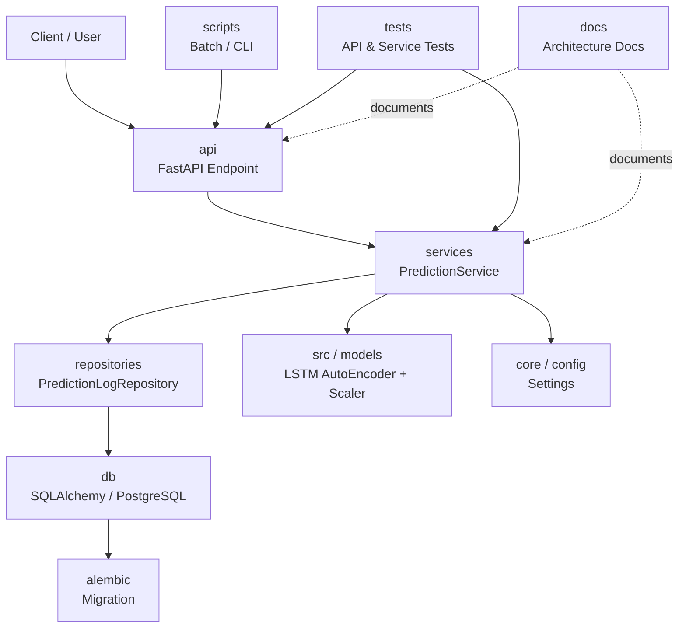

## ディレクトリ責務一覧
| ディレクトリ                 | 主な責務                         |
| ---------------------- | ---------------------------- |
| `api`                  | FastAPIのエンドポイント定義            |
| `services`             | 推論・判定・保存などの業務処理              |
| `repositories`         | DBアクセス処理                     |
| `db`                   | DB接続、SQLAlchemy設定、モデル定義      |
| `core`                 | 共通設定、settings、共通処理           |
| `config`               | YAMLや環境別設定                   |
| `models`               | 学習済みモデル、scalerなど             |
| `src`                  | 学習・特徴量・モデル定義などML処理           |
| `scripts`              | バッチ実行、CLI、運用スクリプト            |
| `alembic`              | DBマイグレーション                   |
| `tests`                | API/Serviceテスト               |
| `data`                 | raw/processed/external/ciデータ |
| `notebooks`            | 実験・分析                        |
| `outputs/results/logs` | 実行結果、評価結果、ログ                 |
| `docs`                 | 設計資料、構成図、README補足            |
| `docker`               | Docker関連ファイル                 |
