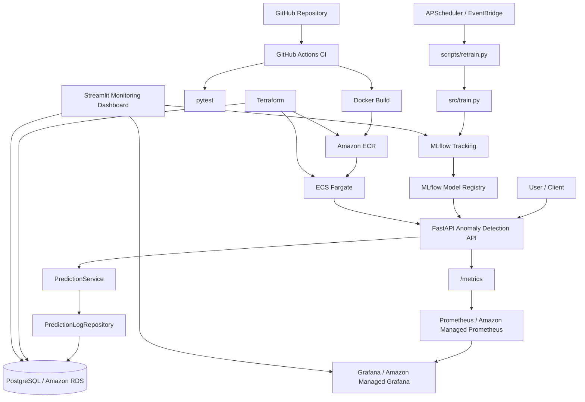

```mermaid
flowchart TB

    User[User / Client] --> API[FastAPI Anomaly Detection API]

    API --> Service[PredictionService]
    Service --> Repo[PredictionLogRepository]
    Repo --> DB[(PostgreSQL / Amazon RDS)]

    API --> Metrics["/metrics"]
    Metrics --> Prometheus[Prometheus / Amazon Managed Prometheus]
    Prometheus --> Grafana[Grafana / Amazon Managed Grafana]

    Train[src/train.py]
    Retrain[scripts/retrain.py]
    Scheduler[APScheduler / EventBridge]

    Scheduler --> Retrain
    Retrain --> Train
    Train --> MLflow[MLflow Tracking]
    MLflow --> Registry[MLflow Model Registry]
    Registry --> API

    GitHub[GitHub Repository] --> Actions[GitHub Actions CI]
    Actions --> Test[pytest]
    Actions --> Build[Docker Build]
    Build --> ECR[Amazon ECR]
    ECR --> ECS[ECS Fargate]
    ECS --> API

    Terraform[Terraform] --> ECR
    Terraform --> ECS
    Terraform --> DB

    Streamlit[Streamlit Monitoring Dashboard] --> DB
    Streamlit --> MLflow
    Streamlit --> Grafana
```