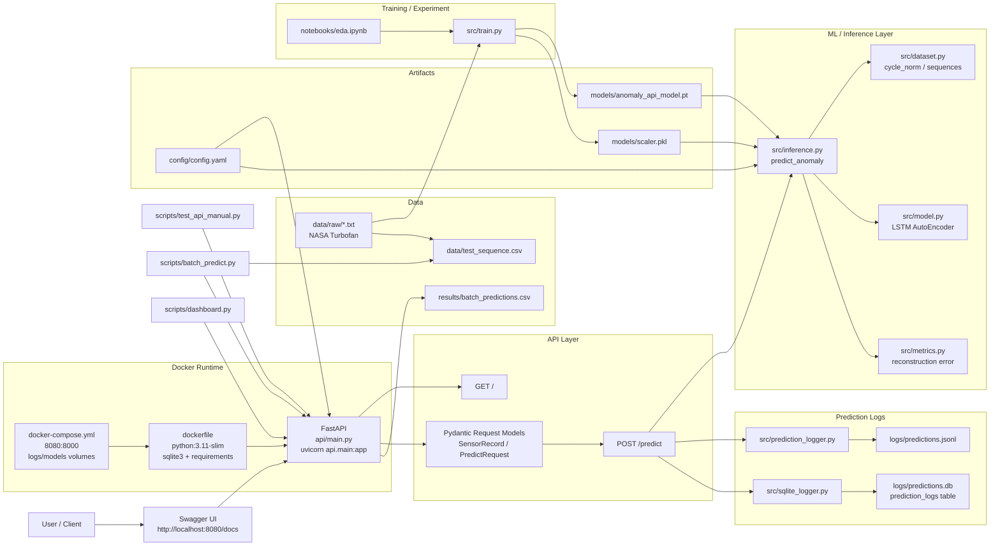

# System Diagram

```mermaid
flowchart LR
    user[User / Client]
    swagger[Swagger UI<br/>http://localhost:8080/docs]
    manual[scripts/test_api_manual.py]
    batch[scripts/batch_predict.py]
    dashboard[scripts/dashboard.py]

    subgraph docker[Docker Runtime]
        compose[docker-compose.yml<br/>8080:8000<br/>logs/models volumes]
        image[dockerfile<br/>python:3.11-slim<br/>sqlite3 + requirements]
        api[FastAPI<br/>api/main.py<br/>uvicorn api.main:app]
    end

    subgraph api_layer[API Layer]
        schema[Pydantic Request Models<br/>SensorRecord / PredictRequest]
        predict[POST /predict]
        health[GET /]
    end

    subgraph ml_layer[ML / Inference Layer]
        inference[src/inference.py<br/>predict_anomaly]
        dataset[src/dataset.py<br/>cycle_norm / sequences]
        model[src/model.py<br/>LSTM AutoEncoder]
        metrics[src/metrics.py<br/>reconstruction error]
    end

    subgraph artifacts[Artifacts]
        config[config/config.yaml]
        weights[models/anomaly_api_model.pt]
        scaler[models/scaler.pkl]
    end

    subgraph data_layer[Data]
        raw[data/raw/*.txt<br/>NASA Turbofan]
        testcsv[data/test_sequence.csv]
        results[results/batch_predictions.csv]
    end

    subgraph logging[Prediction Logs]
        jsonlog[logs/predictions.jsonl]
        sqlite[logs/predictions.db<br/>prediction_logs table]
        filelogger[src/prediction_logger.py]
        sqlitelogger[src/sqlite_logger.py]
    end

    subgraph training[Training / Experiment]
        notebook[notebooks/eda.ipynb]
        train[src/train.py]
    end

    user --> swagger
    swagger --> api
    manual --> api
    batch --> testcsv
    batch --> api
    dashboard --> api

    compose --> image
    image --> api
    api --> health
    api --> schema
    schema --> predict

    predict --> inference
    inference --> dataset
    inference --> model
    inference --> metrics

    config --> api
    config --> inference
    weights --> inference
    scaler --> inference

    raw --> train
    notebook --> train
    train --> weights
    train --> scaler
    raw --> testcsv

    predict --> filelogger
    predict --> sqlitelogger
    filelogger --> jsonlog
    sqlitelogger --> sqlite

    api --> results
```
